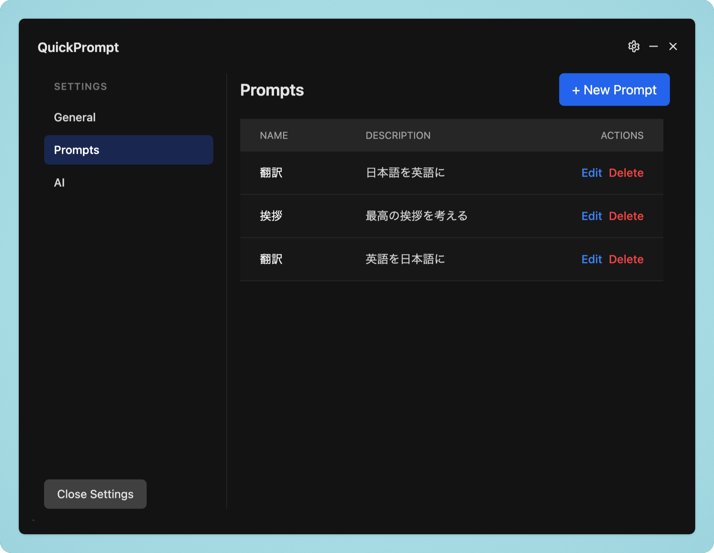

<div align="center">
  
  <h1>QuickPrompt</h1>
  <p>シンプルなLLMプロンプトランチャー</p>
</div>

---

`QuickPrompt` は、必要な時にいつでもAIプロンプトを呼び出し、即座に結果を得られるように設計されたデスクトップアプリケーションです。グローバルショートカットキーを使えば、どのアプリケーション上で作業していても、瞬時に `QuickPrompt` を起動できます。

## ✨ 特徴

- **どこからでもアクセス**: グローバルショートカットで、いつでもアプリを呼び出せます。
- **プロンプトの管理**: よく使うプロンプトを保存し、簡単に切り替えられます。
- **柔軟な入力**: プロンプトにプレースホルダーを設定しプロンプトの一部をフォームで書き換えることができます。
- **クリップボード連携**: 生成された結果は自動でクリップボードにコピーされ、すぐに貼り付けられます。

## 🚀 デモンストレーション


## 📝 使い方

設定画面に進み、AIのタブからモデルプロバイダーのAPIキーを設定します。プロンプトの登録は設定画面のPromptsタブで行います。



アプリを立ち上げておくと、グローバルショートカット（デフォルトは`Cmd + Shift + Space`）で起動できます。


## 🛠️ セットアップと実行

1.  **依存関係のインストール:**
    ```bash
    npm install
    ```

2.  **開発モードで起動:**
    ```bash
    npm run dev
    ```

3.  **ビルド:**
    ```bash
    npm run build
    ```
    ビルドされたアプリケーションは `release` ディレクトリに生成されます。
